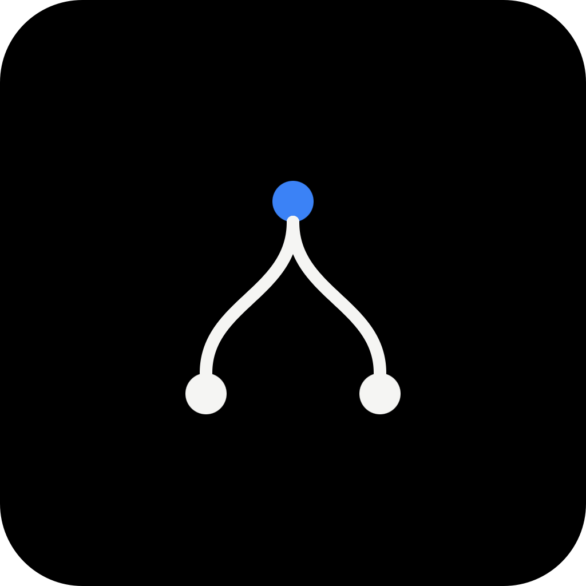

<div align="center">



# RepoManager

**A desktop control room for your local git repositories — run dev servers, drive [Claude Code](https://claude.com/claude-code), and manage branches & releases, all in one window.**


</div>

---

## Overview

Add your repo folders once and RepoManager keeps them at your fingertips. Each repo gets its own dedicated workspace: a terminal for its dev server, a responsive grid of interactive Claude Code sessions, and inline git controls for committing, switching branches, and cutting releases — without leaving the app.

## Features

- **📁 Repo sidebar** — add folders via a native picker; the list persists across restarts (`electron-store`).
- **▶️ App output terminal** — Run/Stop the repo's dev command. The command is auto-detected from `package.json` (`dev` → `start`) and the package manager from the lockfile (`pnpm` / `yarn` / `bun` / `npm`). Editable and saved per repo.
- **🤖 Claude Code grid** — open multiple independent `claude` terminal panels per repo in a responsive grid. Add, rename, and close panels on the fly, with configurable model, permission mode, and effort defaults.
- **🌿 Git controls** — see branch and dirty-state at a glance, commit & push, and switch or create branches inline.
- **🚀 Releases** — bump the version (patch / minor / major), tag it, and trigger a GitHub Actions build — straight from the toolbar.
- **⚙️ Settings** — theme, terminal font, and Claude launch defaults.

## Tech stack

- **Electron** + **TypeScript** + **React 19**, scaffolded with [electron-vite](https://electron-vite.org)
- **shadcn/ui** + **Tailwind CSS v4**
- **[zustand](https://github.com/pmndrs/zustand)** for renderer state
- Embedded terminals via **[xterm.js](https://xtermjs.org)** (renderer) + **[node-pty](https://github.com/microsoft/node-pty)** (main) over IPC

## Getting started

```bash
npm install      # also rebuilds node-pty against Electron's ABI (postinstall)
npm run dev      # launch the app with hot reload
```

## Scripts

| Command | What it does |
| --- | --- |
| `npm run dev` | Launch the app with hot reload |
| `npm run typecheck` | Type-check the main, preload, and renderer projects |
| `npm run build` | Build all three targets into `out/` |
| `npm run dist` | Package a distributable installer (electron-builder) |
| `npm run rebuild` | Rebuild `node-pty` against the current Electron ABI |

Distributables are built for **macOS** (`dmg` + `zip`) and **Windows** (`nsis`). Releases are produced by the [`Release`](.github/workflows/release.yml) workflow, triggered by pushing a `v*` tag (which the in-app **Release** button does for you).

## How PTYs are spawned

Every terminal spawns the user's **login + interactive shell** (`$SHELL -lic '<command>'`) in the repo's directory. This is required because a GUI app launched from Finder inherits a minimal `launchd` PATH — `claude` (which may be a shell function), `node` (via nvm), and package managers are only resolvable after the shell sources `.zprofile` / `.zshrc`. The resolved login-shell environment is also cached at startup (`src/main/shell-env.ts`).

## Project layout

```
src/
├─ main/                  # Electron main process
│  ├─ index.ts            # window + lifecycle, before-quit PTY cleanup
│  ├─ store.ts            # electron-store: repos + per-repo runCommand
│  ├─ shell-env.ts        # resolve login-shell PATH once
│  └─ ipc/                # pty, repos, detect, git handlers
├─ preload/index.ts       # contextBridge `window.api` (the security boundary)
├─ icons/                 # app icons (.icns / .ico / .png)
└─ renderer/src/
   ├─ components/         # Sidebar, Workspace, terminals, git & release controls, ui/
   ├─ store/              # zustand UI + settings state
   ├─ lib/                # Claude command helpers, utils
   └─ assets/main.css     # Tailwind v4 + shadcn theme
```

## License

[MIT](LICENSE) © Callum
